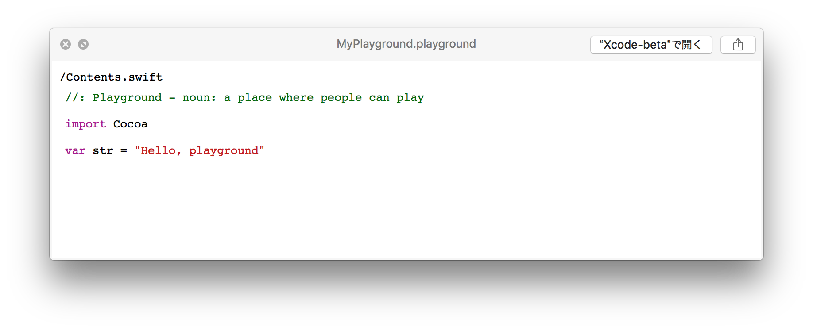
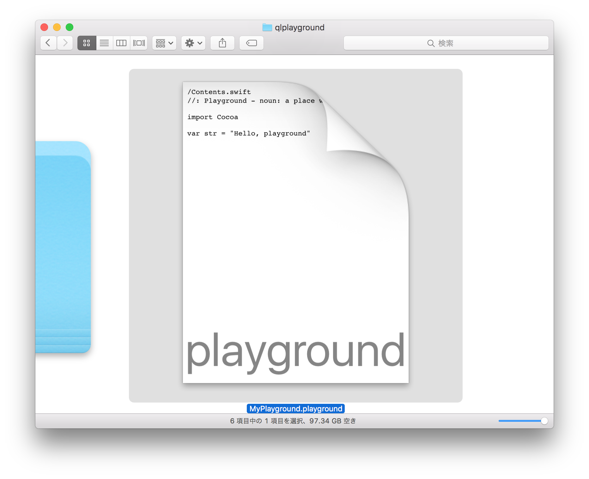

# qlplayground
[](LICENSE)

`qlplayground` is a QuickLook plugin for Swift files.




## Features
- Support `.swift`
- Support `.playground` containing multiple pages
- Syntax highlight by [Highlight.js](https://github.com/isagalaev/highlight.js)

## Requirements
- OS X 10.10.5 or later

## Installation
1. Download [qlplayground.qlgenerator-0.1.zip](http://github.com/norio-nomura/qlplayground/releases/download/0.2/qlplayground.qlgenerator-0.2.zip) (2015/09/21 updated)
2. Unzip it
3. Move `qlplayground.qlgenerator` to `~/Library/QuickLook` folder
4. run `qlmanage -r` in `Terminal.app`

## Configuration
Change style to `dark`:
```sh
defaults write io.github.norio-nomura.qlplayground HighlightStyle dark
```

Style list is [here](http://github.com/norio-nomura/qlplayground/tree/master/qlplayground/highlight/styles/).

## Author

Norio Nomura

## License

`qlplayground` is available under the MIT license. See the LICENSE file for more info.
